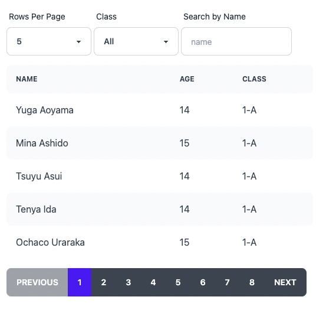

# Feathers-Pinia Pagination Example

This example app uses `useFind` and `usePagination` from Feathers-Pinia.

## Setup

1. Clone and run `pnpm i`
2. Run the app with `pnpm dev`
3. Open your browser to http://localhost:3333

If everything went well, you'll see the app, above.

Learn more about Feathers-Pinia at [https://feathers-pinia.pages.dev](https://feathers-pinia.pages.dev)

